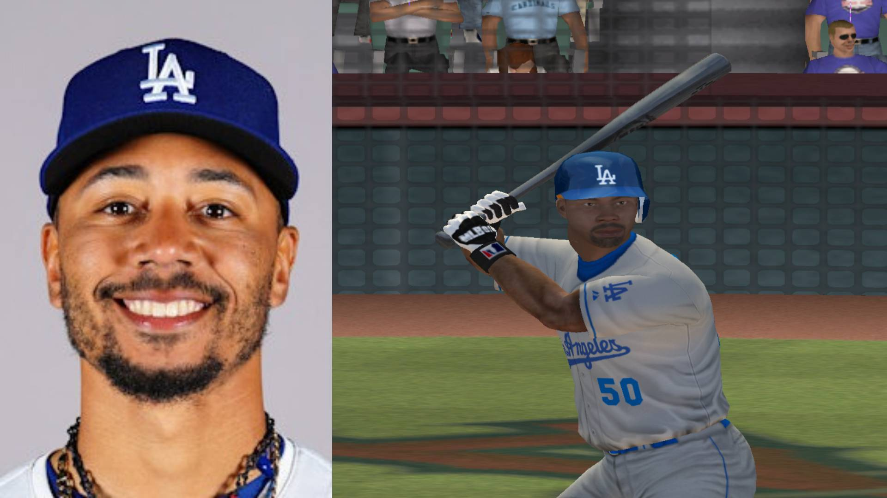
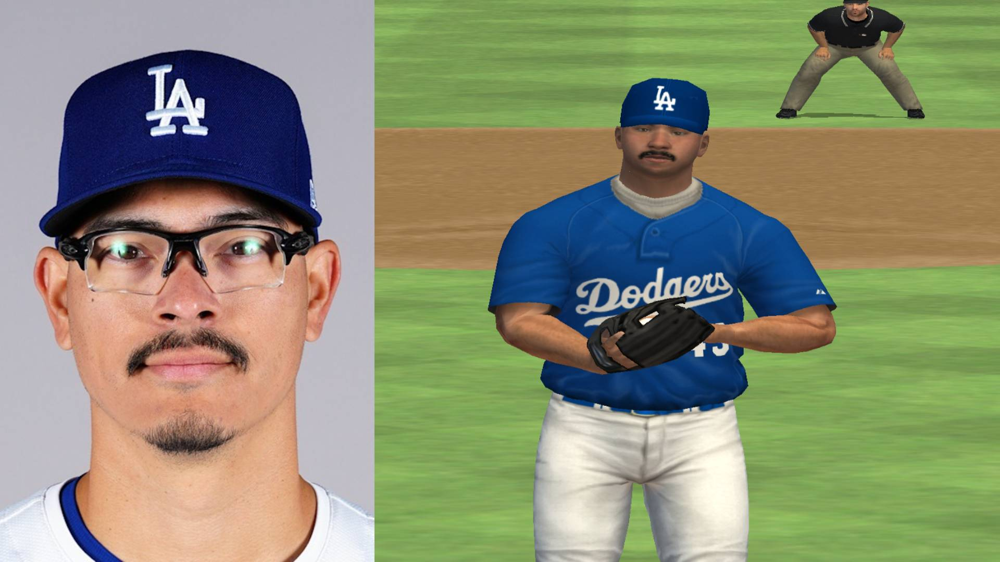

# MLB 09 Redux

MLB 09 Redux is a project that brings **MLB 09: The Show** (PS2) into the modern era by injecting over **1,200 current MLB players** directly into the game's save files. 


The project uses **Python**, official **MLB APIs**, and **computer vision** with [InsightFace](https://github.com/deepinsight/insightface) to generate accurate player attributes, appearances, and rosters.

## Features
- Injects **1,200+ real MLB players** into MLB 09: The Show (PS2).
- Pulls live player data from the **MLB and MLB The Show APIs**.
- Generates accurate:
  - Names  
  - Positions  
  - Ratings  
  - Height & weight  
  - **Facial hair classification** (full beard, goatee, mustache, stubble, clean shaven)
  - **Eye color detection** (brown, blue)
  - Skin tone & ethnicity (via facial analysis)
- **Machine learning classifiers** trained on custom datasets for facial feature recognition.
- **80.9% revised accuracy** on beard classification with logical pairing allowances.
- Fully automated player injection into **game hex save files**.
- Breathing new life into a beloved baseball game.

## Tech Stack
- **Python** – scripting and automation
- **DeepFace** – skin tone & ethnicity classification
- **InsightFace** – facial embedding extraction
- **scikit-learn** – Logistic Regression classifiers
- **OpenCV** – image processing
- **MLB API & MLB The Show API** – real player data
- **Hex file manipulation** – direct save file editing

## How It Works
1. **Fetch Player Data:**  
   Python scripts query the MLB APIs to retrieve up-to-date player stats and information.

2. **Analyze Player Ethnicity:**
	DeepFace processes player photos to determine **skin tone and ethnicity**, ensuring realistic in-game representations.

3. **Train Facial Feature Classifiers:**
   - **Beard Classification:** Five categories (full, goatee, mustache, none, stubble) with 68.3% standard accuracy, 80.9% revised accuracy
   - **Eye Color Classification:** Near-perfect accuracy on trained datasets
   - InsightFace extracts facial embeddings from our custom datasets
   - Logistic Regression models are trained on these embeddings

4. **Classify MLB Player Images:**
   - InsightFace processes MLB player headshots to extract facial embeddings
   - Trained models classify each player's **beard style** and **eye color**

5. **Inject into Game Saves:**  
   Final data is written directly into the game’s hex files, replacing outdated players with the **current 2025 MLB roster**.

## Facial Feature Classification System

### Beard Styles (5 Categories)
- **Full beard** – Complete facial hair coverage
- **Goatee** – Chin beard with mustache
- **Mustache** – Upper lip hair only
- **None** – Clean shaven
- **Stubble** – Short, grown-out beard

### Eye Colors
- **Brown** – Most common eye color
- **Blue** – Light-colored eyes

### Model Performance
- **Beard Classifier:** 68.3% standard accuracy, 80.9% revised accuracy (allowing stubble↔none and goatee↔full confusion)
- **Eye Color Classifier:** ~100% accuracy on validation data
- **Confusion Matrix Analysis:** Detailed breakdown of classification performance

## Visual Comparison: Real Player vs. In-Game Representation


*Mike Trout*


*Mookie Betts*


*Anthony Banda*

## Example Output
Before → After  
- Default 2008 stats → Accurate 2025 ratings and positions  

<!-- ## Demonstration -->
<!-- Check out the project in action: [YouTube Demonstration](https://www.youtube.com) -->
## Future Improvements
- Expand facial feature classification
- Add support for free agent players.
- Update team textures.
- Build a simple GUI for roster injection.

## File Structure

```
mlb-09-redux/
├── roster.mlb                    # Generated roster file for game injection
├── README.md                     # Project documentation
├── requirements.txt              # Python dependencies
├── .gitignore                    # Git exclusion rules
├── assets/                       # Visual assets and sample images
│   ├── Banda.jpg
│   ├── Betts.jpg
│   ├── screen.png
│   └── Trout.jpg
├── data_collection/              # MLB API integration
│   ├── mlb_api.py               # Main API client
│   └── mlb_cards.py             # The Show card data collection
├── data_processing/              # Player data aggregation and formatting
│   ├── combined_players.py      # Merge data from multiple sources
│   └── roster_builder.py        # Generate final roster structure
├── mlb_headshots/               # Downloaded MLB player images (1,200+)
├── rosters/                     # Generated roster files
├── util/                        # Utility functions and helpers
│   ├── roster_data_exporter.py  # Export roster data for game injection
│   └── utility.py               # Common utility functions
└── visual_analysis/             # Core ML pipeline for facial features
    ├── classify_all.py          # Main classification pipeline
    ├── ethnicity_analyzer.py    # Ethnicity analysis using DeepFace
    ├── extract_embeddings.py    # InsightFace embedding extraction
    ├── get_beards.py            # Beard-specific processing
    ├── skin_tone_analyzer.py    # Skin tone classification
    ├── train_attribute_models.py # Train beard and eye classifiers
    ├── classifiers/             # Serialized trained models
    │   ├── beard.pkl           # Beard style classifier
    │   ├── beard_labels.pkl    # Beard label encoder
    │   ├── eye_color.pkl       # Eye color classifier
    │   └── eye_color_labels.pkl # Eye color label encoder
    ├── dataset/                 # Training datasets
    │   ├── beard/              # 5 beard categories
    │   └── eyes/               # Eye color categories
    ├── embeddings/              # Extracted facial embeddings
    │   ├── beard.npz           # Beard training embeddings
    │   └── eye_color.npz       # Eye color training embeddings
    └── visualizations/          # Performance analysis and reporting
        ├── visualize_beards.py  # Beard classifier evaluation
        ├── visualize_eyes.py    # Eye color classifier evaluation
        └── visualize_facial_data.py # Combined facial feature analysis
```

## License
This project is for **educational purposes only**.  
All MLB player data is property of **Major League Baseball** and **MLB The Show**.
